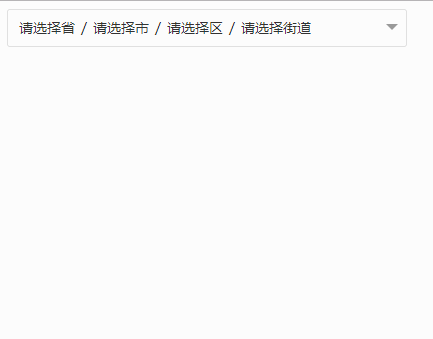

# 可配置级别地址联动选择框，最大可支持四级地址联动

  仿select的地址联动选择框，可根据配置选择联动级别，最大支持四级联动。可根据传入地址编码回显地址，地址变动时通过location方法监听回传地址对象。

> 效果预览



> 使用方法

```
<template>
  <linkarea :loCode='1101' :level= 4 @location="location"></linkarea>
</template>

```

> 参数说明

- loCode 非必需，类型string，需要回显地址时使用，地址编码必须对应地址json中的code；
- level  非必需，类型int，显示层级参数，参数无效或者不传时默认显示4级联动，即省、市、区、街道；1级只显示省，2级显示省、市；以此类推。（参数大于1时向下取整，最大为4级）
- location 监听组件地址变化函数，接收object对象，形如{name :'',value:''},其中name对应所选中文地址，value对应地址编码。


